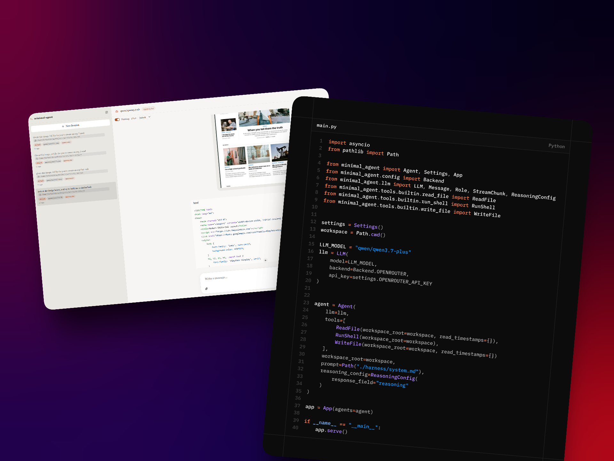

# Minimal Agent



A minimal toolkit for building your own agent harness in Python — tools, skills, sub-agents, and observability on top of any OpenAI-compatible backend (OpenAI, Anthropic, OpenRouter, or a local server).


## Install

Requires Python >= 3.11.

```bash
pip install mini-agent-kit
# with the bundled web UI server:
pip install "mini-agent-kit[server]"
```

The distribution is named `mini-agent-kit` on PyPI; the import name is `minimal_agent` (`from minimal_agent import Agent`).

To hack on the framework itself, clone the repo and use [uv](https://docs.astral.sh/uv/):

```bash
cd minimal_agent
uv sync
```

Copy `.env.example` to `.env` and set your API key:

```bash
cp .env.example .env
# Edit .env — set LLM_BACKEND and LLM_BACKEND_API_KEY
```

| Backend | `LLM_BACKEND` | Notes |
|---|---|---|
| OpenAI | `openai` | Default. Uses `gpt-4o-mini` by default |
| Anthropic | `anthropic` | Via OpenAI-compatible endpoint |
| OpenRouter | `openrouter` | Any model on OpenRouter |
| Local server | `localhost` | vLLM, llama.cpp, LM Studio, Ollama — set `LLM_BACKEND_BASE_URL` |

## Quickstart

`minimal_agent` is an installable library. You create a new project that depends on it, wire up the tools you want, and run it however you like.

```python
import asyncio
from pathlib import Path

from minimal_agent import LLM, Agent, Message, Role, Settings
from minimal_agent.tools.builtin import ReadFile, RunShell

settings = Settings()
workspace = Path.cwd()

llm = LLM(
    model=settings.LLM_MODEL,
    backend=settings.LLM_BACKEND,
)

agent = Agent(
    llm=llm,
    tools=[
        ReadFile(workspace_root=workspace, read_timestamps={}),
        RunShell(workspace_root=workspace),
    ],
    workspace_root=workspace,
)


async def main():
    session = await agent.create_session()
    session.context.add(Message(role=Role.USER, content="List the files in this directory"))

    async for message in agent.run(session.context):
        if message.role == Role.ASSISTANT and message.content:
            print(message.content)

asyncio.run(main())
```

That's a working agent. It reads the user message, calls the LLM, uses tools if needed, and prints the response. Sessions are persisted to disk automatically and can be resumed with `agent.load_session(session_id)`.

For the full guide to building your own agent — custom tools, prompts, context sources, reasoning, skills, sub-agents, and the observability model — see **[minimal_agent/README.md](minimal_agent/README.md)**.

## What you get

- **Tools** — subclass `BaseTool` with a Pydantic input schema and an `invoke()` method. Built-in: `read_file`, `write_file`, `edit_file`, `glob`, `grep`, `run_shell`, `spawn_agents`, `web_search`, `web_extract`. See [Tools](minimal_agent/README.md#tools).
- **MCP** — plug any [MCP](https://modelcontextprotocol.io) server's tools in alongside the built-ins, over stdio or streamable HTTP. See [Connect MCP servers](#connect-mcp-servers).
- **Context sources** — inject dynamic environment info (git status, directory trees, your own) into what the model sees, with control over when it's gathered and how fresh it stays. See [Context sources](minimal_agent/README.md#4-write-a-custom-context-source).
- **Reasoning** — turn on a model's "thinking" via `ReasoningConfig`; the trace rides on `message.reasoning`. See [Reasoning](minimal_agent/README.md#reasoning).
- **Skills** — reusable prompt templates loaded on demand from `.minimal_agent/skills/`, following the [Agent Skills Specification](https://agentskills.io/specification). See [Skills](minimal_agent/README.md#5-write-a-skill).
- **Sub-agents** — the built-in `spawn_agents` tool fans work out to concurrent sub-agents, each fully recorded under the parent session. See [Spawning sub-agents](minimal_agent/README.md#spawning-sub-agents).
- **Observability** — every session records its transcript, timeline, and a byte-exact audit of every LLM call to disk, with no wiring required — sub-agents included. See [Observability](minimal_agent/README.md#observability).

## Serve it in the browser

Any agent you build can be served over HTTP with a bundled chat web UI — one process, one port, no Node required.

```bash
pip install "mini-agent-kit[server]"
```

```python
# my_app.py
from minimal_agent import App

app = App(agents=agent)          # or {"swe": swe_agent, "research": research_agent}

if __name__ == "__main__":
    app.serve()                  # → http://localhost:8000
```

`python my_app.py` serves the chat UI at `/`, the JSON API under `/api`, and interactive docs at `/docs`. Responses stream over SSE, sessions persist to disk and resume across restarts, and with multiple agents registered the UI's new-session dialog lets you pick one. `App` subclasses `FastAPI`, so routes, middleware, `lifespan`, and `uvicorn my_app:app --reload` all work as usual.

Ready-to-run examples live in [example/](example/) — a [swe_agent/](example/swe_agent/) (full read/write/shell toolset plus sub-agents) and a [research_agent/](example/research_agent/) (web search + read-only files, reasoning on). Each is one `main.py` you can copy as a starting point; see [example/README.md](example/README.md). The UI's source is in [web/](web/); from a source checkout, build it once into the package with `make ui` (needs Node), or hack on it live with `npm run dev` against a running `App`.

## Connect MCP servers

Any [MCP](https://modelcontextprotocol.io) server's tools can sit alongside the built-ins. Install the extra:

```bash
pip install "mini-agent-kit[mcp]"
```

Wrap your agent in an `MCPToolProvider` — it connects to each server, discovers its tools, and hands you ready-to-register tool instances:

```python
import asyncio
from pathlib import Path

from minimal_agent import LLM, Agent, Message, Role, Settings
from minimal_agent.tools.builtin import ReadFile, RunShell
from minimal_agent.tools.mcp import MCPServerHTTP, MCPServerStdio, MCPToolProvider

settings = Settings()
workspace = Path.cwd()

llm = LLM(model=settings.LLM_MODEL, backend=settings.LLM_BACKEND)


async def main():
    async with MCPToolProvider(
        servers=[
            # A local server, spawned as a subprocess:
            MCPServerStdio(
                name="fs",
                command="npx",
                args=["-y", "@modelcontextprotocol/server-filesystem", str(workspace)],
            ),
            # A remote server over streamable HTTP:
            MCPServerHTTP(
                name="linear",
                url="https://mcp.linear.app/mcp",
                headers={"Authorization": "Bearer <token>"},
            ),
        ],
    ) as mcp_tools:
        agent = Agent(
            llm=llm,
            tools=[
                ReadFile(workspace_root=workspace, read_timestamps={}),
                RunShell(workspace_root=workspace),
                *mcp_tools,   # e.g. mcp__fs__read_file, mcp__linear__create_issue
            ],
            workspace_root=workspace,
        )

        session = await agent.create_session()
        session.context.add(
            Message(role=Role.USER, content="File a Linear issue for the TODOs in main.py")
        )
        async for message in agent.run(session.context):
            if message.role == Role.ASSISTANT and message.content:
                print(message.content)


asyncio.run(main())
```

Tool names are prefixed `mcp__<server>__<tool>`, so nothing collides with your local tools. Non-read-only MCP tools ask for permission through the same `permission_callback` as built-in tools; servers you trust can be marked `MCPServerStdio(..., require_permission=False)`.

### Or configure servers in `.minimal_agent/mcp.json`

Instead of programmatic configs, drop the standard `mcpServers` JSON — the same format MCP marketplaces publish and Claude Desktop / Cursor read, so install snippets paste in unchanged — into `.minimal_agent/mcp.json`:

```json
{
  "mcpServers": {
    "notionApi": {
      "command": "npx",
      "args": ["-y", "@notionhq/notion-mcp-server"],
      "env": {
        "OPENAPI_MCP_HEADERS": "{\"Authorization\": \"Bearer ${NOTION_TOKEN}\", \"Notion-Version\": \"2022-06-28\"}"
      }
    },
    "linear": {
      "url": "https://mcp.linear.app/mcp",
      "headers": { "Authorization": "Bearer ${LINEAR_TOKEN}" }
    }
  }
}
```

```python
async with MCPToolProvider.from_json() as mcp_tools:   # reads .minimal_agent/mcp.json
    agent = Agent(llm=llm, tools=[*local_tools, *mcp_tools], workspace_root=workspace)
```

Entries with `command` run as stdio subprocesses; entries with `url` connect over streamable HTTP. `${VAR}` references are expanded from the environment at load time (and fail fast if unset), so tokens stay in your `.env` — never commit secrets into the JSON itself. `MCPToolProvider.from_json(path)` accepts a custom location, and `load_mcp_servers(path)` returns the parsed configs if you want to filter or extend them before constructing the provider.

The provider must stay open for the agent's whole life. To serve an MCP-equipped agent over HTTP, use the async `app.a_serve()` inside the provider block — the blocking `app.serve()` would try to own its own event loop:

```python
async def main():
    async with MCPToolProvider(servers=[...]) as mcp_tools:
        app = App(agents=Agent(llm=llm, tools=[*local_tools, *mcp_tools]))
        await app.a_serve()                  # async serve() — same host/port args
```

## Development

```bash
cd minimal_agent
make format    # ruff format
make lint      # ruff check
make test      # pytest
```
