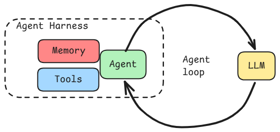

# Minimal Agent

A minimal async agent framework in Python. An agent loop drives an LLM that can call tools, with provider details abstracted behind a provider-agnostic facade.



## Install

Requires Python >= 3.11.

```bash
pip install mini-agent-kit
# with the bundled web UI server:
pip install "mini-agent-kit[server]"
```

The distribution is named `mini-agent-kit` on PyPI; the import name is `minimal_agent` (`from minimal_agent import Agent`).

To hack on the framework itself, clone the repo and use [uv](https://docs.astral.sh/uv/):

```bash
cd minimal_agent
uv sync
```

Copy `.env.example` to `.env` and set your API key:

```bash
cp .env.example .env
# Edit .env — set LLM_BACKEND and LLM_BACKEND_API_KEY
```

| Backend | `LLM_BACKEND` | Notes |
|---|---|---|
| OpenAI | `openai` | Default. Uses `gpt-4o-mini` by default |
| Anthropic | `anthropic` | Via OpenAI-compatible endpoint |
| OpenRouter | `openrouter` | Any model on OpenRouter |
| Local server | `localhost` | vLLM, llama.cpp, LM Studio, Ollama — set `LLM_BACKEND_BASE_URL` |

## Build your own agent

`minimal_agent` is an installable library. You create a new project that depends on it, wire up the tools you want, and run it however you like.

### 1. Create a new project

```
my_project/
  main.py
  pyproject.toml
```

In `pyproject.toml`, add `minimal_agent` as a dependency (path reference to the local package):

```toml
[project]
name = "my-project"
requires-python = ">=3.11"
dependencies = [
    "minimal-agent",
]

[tool.uv.sources]
minimal-agent = { path = "../minimal_agent" }
```

### 2. Set up the LLM and agent

```python
# main.py
import asyncio
from pathlib import Path

from minimal_agent import Agent, Settings
from minimal_agent.llm import LLM, Message, Role
from minimal_agent.tools.builtin.read_file import ReadFile
from minimal_agent.tools.builtin.run_shell import RunShell

settings = Settings()
workspace = Path.cwd()

llm = LLM(
    model=settings.LLM_MODEL,
    backend=settings.LLM_BACKEND,
)

agent = Agent(
    llm=llm,
    tools=[
        ReadFile(workspace_root=workspace, read_timestamps={}),
        RunShell(workspace_root=workspace),
    ],
    workspace_root=workspace,
)


async def main():
    # The agent builds the system prompt and stamps its identity
    # (model, backend, workspace) onto the session.
    session = await agent.create_session()

    # Add a user message
    session.context.add(Message(role=Role.USER, content="List the files in this directory"))

    # Run the agent loop
    async for message in agent.run(session.context):
        if message.role == Role.ASSISTANT and message.content:
            print(message.content)

asyncio.run(main())
```

That's a working agent. It reads the user message, calls the LLM, uses tools if needed, and prints the response.

Sessions are persisted to disk. To resume one later, use `session = await agent.load_session(session_id)` — the agent rebuilds the system prompt fresh and validates that the session's model, backend, and workspace match its own.

By default sessions live under `.minimal_agent/sessions/`. Where they live — and how they're recorded — is a `SessionManager`, which you only construct when you want a different policy:

```python
from minimal_agent import SessionManager

agent = Agent(
    llm=llm,
    tools=[...],
    workspace_root=workspace,
    sessions=SessionManager(base_dir=Path("/var/lib/myapp/sessions")),
)

sessions = agent.sessions.list_sessions()   # most recent first
```

The agent supplies identity (prompt, model, tools); the manager supplies storage. Token usage is accounted automatically — every LLM call's usage lands in `session.json` without any wiring on your side.

### 3. Add your own tools

Create a tool by subclassing `BaseTool`. A tool needs three things: a name, a Pydantic input schema, and an `invoke` method.

```python
from pydantic import BaseModel, Field
from minimal_agent.tools.base import BaseTool
from minimal_agent.tools.context import ToolContext


class LookupInput(BaseModel):
    """Look up a customer by email."""
    email: str = Field(..., description="Customer email address")


class LookupCustomer(BaseTool[LookupInput, str]):
    name = "lookup_customer"
    input_schema = LookupInput

    def __init__(self, db):
        self._db = db

    async def invoke(self, args: LookupInput, ctx: ToolContext) -> str:
        customer = await self._db.find_by_email(args.email)
        if not customer:
            return "No customer found"
        return f"Found: {customer.name} (id={customer.id})"
```

Then pass it to your agent:

```python
agent = Agent(
    llm=llm,
    tools=[
        LookupCustomer(db=my_database),
        ReadFile(workspace_root=workspace),
    ],
)
```

The model sees the tool's name, the docstring on the input schema (as the tool description), and the field descriptions. That's all it needs to decide when and how to call it.

### Optional hooks

Override these methods on `BaseTool` for more control:

- **`needs_permission(args)`** — Return `True` to require user confirmation before execution. Use for destructive operations.
- **`validate(args)`** — Semantic validation beyond what Pydantic checks (e.g., "file must exist"). Return `ValidationOk()` or `ValidationErr("reason")`.
- **`render_result_for_assistant(result)`** — Customize what the model sees after the tool runs. Default is `str(result)`.

### 4. Custom system prompts

By default, the agent uses a built-in software engineering prompt. Pass your own:

```python
agent = Agent(
    llm=llm,
    tools=[...],
    prompt="You are a customer support agent. Be helpful and concise.",
)
```

Or point to a markdown file:

```python
agent = Agent(
    llm=llm,
    tools=[...],
    prompt=Path("prompts/support_agent.md"),
)
```

### 5. Context sources

Context sources gather dynamic information about the environment (git status, directory trees, or anything you define) and inject it into what the model sees. Implement the `ContextSource` protocol — any object with a `name` and an async `gather()`:

```python
class DatabaseSchemaSource:
    name = "db_schema"

    async def gather(self, workspace_root) -> str:
        # Return whatever context you want injected
        return "Tables: users, orders, products ..."

agent = Agent(
    llm=llm,
    tools=[...],
    prompt="You are a database assistant.",
    context_sources=[DatabaseSchemaSource()],
    workspace_root=workspace,
)
```

An optional class-level `placement` (from `minimal_agent.context_sources`) declares when a source is gathered and where its output lands:

| `placement` | Gathered | Lands |
|---|---|---|
| `Placement.SESSION` (default) | Once, at session creation | System prompt, labeled as a snapshot |
| `Placement.RUN` | Once per `agent.run()` | Merged into that run's user message |
| `Placement.CALL` | Before every LLM call | Trailing message, refreshed each call |

Use `SESSION` for stable facts, and `RUN` for volatile state that changes between user turns — the built-in `GitStatusSource` is RUN-placed, so the model sees the working tree as of the current turn, not session start. Reserve `CALL` for state that must track the agent's own mid-run side effects; its content is re-sent (uncached) on every call. RUN/CALL content is never written to the transcript, and it reaches the conversation only for sessions created through `agent.create_session()` / `agent.load_session()`.

### Built-in tools

`read_file`, `write_file`, `edit_file`, `glob`, `grep`, `run_shell`, `spawn_agents`, `web_search`, `web_extract`, `get_weather` (stub)

### Skills

Skills are reusable prompt templates stored as markdown files. Drop a `SKILL.md` at `.minimal_agent/skills/<name>/SKILL.md` (project-level) or `~/.minimal_agent/skills/<name>/SKILL.md` (user-level), and the agent sees it in its skill list. When the model decides a skill is relevant, it loads the full instructions on demand via the built-in `skill` tool — cheap metadata always, expensive prompt only when needed.

Skills are auto-discovered when you pass `workspace_root` to the `Agent`. Format follows the official [Agent Skills Specification](https://agentskills.io/specification). See [minimal_agent/README.md](minimal_agent/README.md#5-write-a-skill) for authoring details.

### Observability

Sessions record what happens as they run — no wiring needed. Everything that happens in a session, including every sub-agent, lands in one directory tree:

```
.minimal_agent/sessions/<session-id>/
├── session.json     # identity, aggregate usage (sub-agents included)
├── messages.jsonl   # the conversation
├── events.jsonl     # the timeline: one timestamped event per line
├── calls.jsonl      # one provenance record per LLM call
├── blobs/           # content-addressed system prompts and tool schemas,
│                    # shared by every agent in the session
└── agents/          # one directory per nested agent
    └── a-3f9c21ab/
        ├── agent.json       # who spawned it, task, status, usage, model
        ├── messages.jsonl   # the sub-agent's full transcript
        ├── events.jsonl     # its own timeline
        └── calls.jsonl      # its own call audit
```

`events.jsonl` answers *"what happened, when?"* — a run started, a call took 2.7s and used 876 tokens, a tool was denied after 8 seconds of deliberation, a sub-agent was spawned and completed. `calls.jsonl` + `blobs/` answer *"what exactly did the model see?"* — every call's full input (system prompt, projected messages, injected live blocks, tool schemas) is reconstructible, byte-exactly, from the session directory alone. Both guarantees hold for every agent in the tree: a sub-agent's record is the same shape as the main agent's, just one directory down.

### Sub-agents are recorded too

When the built-in `spawn_agents` tool runs sub-agents, each one gets its own recorded home under `agents/` automatically. The parent's timeline gains `agent.spawn` / `agent.end` events (with status and token usage), the child's `agent.json` points back at the exact tool call that spawned it, and the sub-agent's token usage rolls up into the session's `session.json`.

If you write a custom tool that runs its own agent, you get the same recording with one `with` block — ask the tool's scope for a child:

```python
class DeepResearch(BaseTool[ResearchInput, str]):
    name = "deep_research"

    async def invoke(self, args: ResearchInput, ctx: ToolContext) -> str:
        researcher = Agent(llm=self._llm, tools=self._tools, prompt=RESEARCH_PROMPT)

        with ctx.scope.child(
            spawned_by=self.name, task=args.question, tool_call_id=ctx.tool_call_id
        ) as scope:
            context = scope.new_context(
                system_prompt=await researcher.build_system_prompt(self._root)
            )
            context.add(Message(role=Role.USER, content=args.question))

            answer = ""
            async for msg in researcher.run(context):
                if msg.role == Role.ASSISTANT and msg.content:
                    answer = msg.content
        return answer
```

No sessions, directories, or wiring in sight — the child scope allocates its directory under the session, records the whole nested run, and closes with a truthful status (`completed` / `error` / `abandoned`) even if the sub-agent crashes. In a unit test (no session), the same code runs unrecorded.

Read it back with the audit API:

```python
from minimal_agent import reconstruct_call, session_runs, session_tree

# The holistic view: session → runs → calls, each call carrying its
# full input, its response, latency, usage, tool executions, and any
# sub-agents it spawned.
for run in session_runs(session.session_dir):
    print(run.run_id, run.status, f"{run.duration_ms}ms")
    for call in run.calls:
        print(f"  {call.call_id}: {call.latency_ms}ms, "
              f"{len(call.input.messages)} input messages")
        for agent in call.spawned_agents:
            print(f"    spawned {agent.agent_id}: {agent.task} → {agent.status}")

# The whole tree: the session root's runs plus every nested agent's,
# recursively — sub-agents get the same runs view, one directory down.
tree = session_tree(session.session_dir)
for node in tree.children:
    print(node.agent["task"], node.agent["status"], len(node.runs))

# Or one call's exact input, verified against its recorded hash. Works
# on the session root and on any agents/<id>/ directory alike.
call = reconstruct_call(session.session_dir, "r-4c7d01ab:c1")
assert call.verified
call.messages   # exactly what the model saw, in order
```

Recording is fire-and-forget — it can never fail or slow a run — and a bare in-memory `Context()` records nothing. Because system prompts and tool schemas are content-addressed, *"the agent behaves differently since yesterday"* is answered by diffing two blobs.

### Ship it to Phoenix

The same event stream that writes the local artifacts can be exported to [Arize Phoenix](https://arize.com/docs/phoenix) as OpenTelemetry spans — the run becomes a `CHAIN` span that owns your LLM calls, tools, and sub-agents, nested exactly as they ran. It's a **sink**, not a redesign: no producer, transcript, or artifact changes, and if you never wire it the framework behaves identically.

```bash
pip install "mini-agent-kit[phoenix]"
```

```python
from minimal_agent import Agent, SessionManager
from minimal_agent.observability import PhoenixSink

# One provider per process, pointed at a local Phoenix (OTLP → localhost:6006).
sink = PhoenixSink.for_local(project_name="my-agent")

manager = SessionManager(extra_sinks=[sink])
agent = Agent(llm, tools, workspace_root=root, sessions=manager)

session = await agent.create_session()
async for msg in agent.run(session.context):
    ...
sink.shutdown()   # flush buffered spans on a clean exit
```

Spans stream as the run executes, on a background thread via OTel's `BatchSpanProcessor`, so a slow or down collector drops spans rather than stalling the loop. Phoenix is a **convenience mirror, not the source of truth** — under backpressure it may show fewer spans than `events.jsonl` holds; the local session directory is always complete and authoritative.

By default spans carry timing, token counts, and nesting. Pass `PhoenixSink.for_local(..., full=True)` to also reconstruct each call's input (system prompt + messages) from the local artifacts and flatten it onto the `LLM` span — Phoenix then shows the prompt, at the cost of a per-call blob read and sending prompt content off-box. See [the export spec](minimal_agent/.claude/specifications/phoenix-export.md) for the full event → span mapping.

## Serve it in the browser

Any agent you build can be served over HTTP with a bundled chat web UI — one process, one port, no Node required. Install the server extra:

```bash
pip install "mini-agent-kit[server]"
```

Then hand your agent to an `App`:

```python
# my_app.py
from minimal_agent import App

app = App(agents=agent)          # or {"swe": swe_agent, "research": research_agent}

if __name__ == "__main__":
    app.serve()                  # → http://localhost:8000
```

`python my_app.py` serves the chat UI at `/`, the JSON API under `/api`, and interactive docs at `/docs`. Responses stream over SSE, sessions persist to disk and resume across restarts, and with multiple agents registered the UI's new-session dialog lets you pick one.

`App` subclasses `FastAPI`, so routes, middleware, `lifespan`, and `uvicorn my_app:app --reload` all work as usual. The API also exposes each session's observability artifacts: `GET /api/sessions/{id}/events` (the timeline), `/api/sessions/{id}/calls` (raw audit records), `/api/sessions/{id}/calls/{call_id}` (byte-exact input reconstruction), and `/api/sessions/{id}/runs` (every model input and output, by run and call, in one response).

A ready-to-run two-agent example lives in [example/my_app.py](example/my_app.py) — see [example/README.md](example/README.md). The UI's source is in [web/](web/); from a source checkout, build it once into the package with `make ui` (needs Node), or hack on it live with `npm run dev` against a running `App`.

## Development

```bash
cd minimal_agent
make format    # ruff format
make lint      # ruff check
make test      # pytest
```
