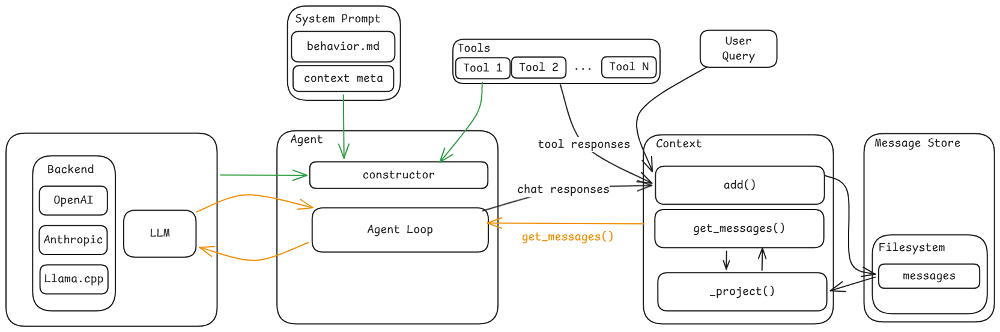

# minimal-agent

A minimal async agent framework in Python. An agent loop drives an LLM that can call tools — you define the prompt, pick the tools, and let the loop handle the rest.

Built on top of the OpenAI SDK (works with any OpenAI-compatible API), Pydantic for schemas, and `asyncio` for concurrency.

## Setup

**Requirements:** Python >= 3.10, [uv](https://docs.astral.sh/uv/) for dependency management.

```bash
# Install dependencies
uv sync

# Copy the example env file and add your API key
cp .env.example .env
# Edit .env → set LLM_BACKEND_API_KEY=sk-...
```

The framework supports multiple LLM backends out of the box: `openai`, `openrouter`, `anthropic`, and `localhost` (for local servers like vLLM, Ollama, LM Studio). Set `LLM_BACKEND` and `LLM_MODEL` in your `.env` file.

## Quickstart

The framework ships with a built-in software engineering agent. Out of the box it can read and write files, search codebases, and run shell commands.

```python
import asyncio
from pathlib import Path

from agent import Agent, Session
from config import settings
from llm import LLM, Message, Role
from tools.builtin.glob import Glob
from tools.builtin.grep import Grep
from tools.builtin.read_file import ReadFile
from tools.builtin.run_shell import RunShell
from tools.builtin.write_file import WriteFile


async def main():
    llm = LLM(
        model=settings.LLM_MODEL,
        backend=settings.LLM_BACKEND,
    )

    workspace = Path.cwd()
    read_timestamps: dict[str, float] = {}

    agent = Agent(
        llm=llm,
        tools=[
            ReadFile(workspace_root=workspace, read_timestamps=read_timestamps),
            WriteFile(workspace_root=workspace, read_timestamps=read_timestamps),
            RunShell(workspace_root=workspace),
            Grep(workspace_root=workspace),
            Glob(workspace_root=workspace),
        ],
    )

    # Build the system prompt (gathers git status, directory tree, etc.)
    system_prompt = await agent.build_system_prompt(workspace_root=workspace)

    # Start a new conversation
    session = Session.create(
        model=settings.LLM_MODEL,
        backend=settings.LLM_BACKEND,
        system_prompt=system_prompt,
    )

    # Send a message and stream the agent's responses
    session.context.add(Message(role=Role.USER, content="What files are in this project?"))

    async for msg in agent.run(session.context):
        if msg.role == Role.ASSISTANT and msg.content:
            print(msg.content)

asyncio.run(main())
```

The agent decides which tools to call, calls them, reads the results, and keeps going until it has an answer. You don't need to manage the loop yourself.

### Resuming a session

Sessions are persisted to disk automatically. To pick up where you left off:

```python
session = Session.load(
    session_id="20260408-143022-a1b2",  # from a previous Session.create()
    model=settings.LLM_MODEL,
    backend=settings.LLM_BACKEND,
    system_prompt=system_prompt,  # rebuilt fresh — not restored from disk
)
```

## Concepts



### Agent

The `Agent` is the core loop. It takes an LLM, a list of tools, and a prompt that defines its personality. Each call to `agent.run(context)` drives a decide-act-observe cycle: ask the LLM what to do → execute tool calls → feed results back → repeat until the LLM is done or `max_turns` is hit.

The agent owns its **identity** — the same agent instance can drive many sessions, and every session inherits its prompt and behavior.

### Session

A `Session` is a single conversation. It holds the message history and metadata (model, backend, timestamps, token usage). Sessions are created with `Session.create()` and resumed with `Session.load()`. Message history is persisted as JSONL on disk.

### Context

`Context` is the agent's view of the conversation. It wraps a `MessageStore` (append-only message log) with the system prompt and a projection strategy. When the agent asks for messages, Context prepends the system prompt and returns the projected history.

### Tools

Tools are how the agent interacts with the world. Each tool is a class that inherits from `BaseTool` and defines an input schema (Pydantic model) and an `invoke()` method. The framework handles argument parsing, validation, permission checks, and error handling — your tool just does its job.

**Built-in tools:**

| Tool | What it does |
|---|---|
| `ReadFile` | Read files with optional offset/limit |
| `WriteFile` | Create or overwrite files |
| `RunShell` | Execute shell commands with timeout and permission checks |
| `Grep` | Search file contents using ripgrep |
| `Glob` | Find files by name pattern |

### System Prompt

The system prompt is built from three parts: a **behavior prompt** (markdown that defines the agent's personality), an **environment block** (workspace metadata), and **context blocks** (dynamic info like git status). The `system_prompt` module handles assembly — you just pass a markdown file or string.

### Skills

Skills are reusable prompt templates stored as markdown files on disk. Instead of baking every specialized instruction into the system prompt, you write a `SKILL.md` per task (e.g. "create a git commit", "review a PR") and the agent loads it on demand.

The model sees a lightweight list of available skills (just names + descriptions) in its system prompt. When one is relevant, it calls the built-in `skill` tool to load the full instructions. This is the same two-phase pattern Anthropic's own agents use — cheap metadata always, expensive prompt only when needed. See the official [Agent Skills Specification](https://agentskills.io/specification) for the file format.

Skills are auto-discovered when you pass `workspace_root` to the `Agent`. Drop a skill at `.minimal_agent/skills/<name>/SKILL.md` in your project (or `~/.minimal_agent/skills/` for user-level skills), and it shows up in the agent's skill list. Project-level skills shadow user-level skills with the same name.

## Building a Custom Agent

The default agent is a software engineer, but you can build anything. Here's a code review agent with a custom prompt and no shell access:

### 1. Write a behavior prompt

Create a markdown file — no special syntax, just instructions for the LLM.

```markdown
<!-- review_agent.md -->
You are a code review assistant. You help developers improve their code
by finding bugs, suggesting simplifications, and enforcing project conventions.

# Tool usage

- Use grep and glob to understand the codebase before commenting.
- Use read_file to see the full context of files mentioned in a review.
- Do not modify any files. You are read-only.

# Style

- Be direct. Say what's wrong, why, and how to fix it.
- Cite specific line numbers when pointing out issues.
```

### 2. Build the agent

Point the agent at your prompt file. Since this isn't a general coding agent, we skip the shell and write tools and explicitly choose our context sources.

```python
from pathlib import Path

from agent import Agent
from llm import LLM
from system_prompt import GitStatusSource
from tools.builtin.glob import Glob
from tools.builtin.grep import Grep
from tools.builtin.read_file import ReadFile


llm = LLM(model="gpt-4o", backend="openai")
workspace = Path.cwd()

agent = Agent(
    llm=llm,
    tools=[
        ReadFile(workspace_root=workspace, read_timestamps={}),
        Grep(workspace_root=workspace),
        Glob(workspace_root=workspace),
    ],
    prompt=Path("review_agent.md"),
    context_sources=[GitStatusSource()],  # git status but no directory tree
)
```

When you pass a custom `prompt`, context sources default to empty — you opt in to exactly what's relevant. The default agent (no `prompt` arg) auto-includes `GitStatusSource` and `DirectoryTreeSource`.

### 3. Write a custom tool

Tools are just async classes with a Pydantic schema. Here's a minimal example:

```python
from pydantic import BaseModel, Field

from tools.base import BaseTool
from tools.context import ToolContext


class GreetInput(BaseModel):
    """Say hello to someone."""
    name: str = Field(..., description="The person's name")


class Greet(BaseTool[GreetInput, str]):
    name = "greet"
    input_schema = GreetInput

    async def invoke(self, args: GreetInput, ctx: ToolContext) -> str:
        return f"Hello, {args.name}!"

    def render_result_for_assistant(self, out: str) -> str:
        return out
```

The `input_schema` docstring becomes the tool description the LLM sees. Field descriptions become parameter descriptions. That's all the LLM needs to know how to call your tool.

**Optional hooks you can override:**

- `validate(args, ctx)` — reject bad inputs before execution
- `needs_permission(args)` — return `True` if this invocation needs user approval
- `render_result_for_assistant(out)` — control what the LLM sees as the tool result

### 4. Write a custom context source

Context sources gather dynamic information about the environment at session start. Any object with a `name` property and an async `gather()` method works — no base class needed.

```python
from pathlib import Path


class PackageJsonSource:
    """Injects package.json contents into the system prompt."""

    @property
    def name(self) -> str:
        return "packageJson"

    async def gather(self, workspace_root: Path) -> str | None:
        pkg = workspace_root / "package.json"
        if not pkg.exists():
            return None
        return pkg.read_text()
```

Pass it to the agent:

```python
agent = Agent(
    llm=llm,
    tools=[...],
    context_sources=[PackageJsonSource(), GitStatusSource()],
)
```

The gathered content shows up in the system prompt as `<context name="packageJson">...</context>`.

### 5. Write a skill

Skills are markdown files with YAML frontmatter. The frontmatter gives the skill a name and a one-line description (this is what the model reads to decide when to use it); the body is the full prompt the model follows once the skill is invoked.

```markdown
<!-- .minimal_agent/skills/commit/SKILL.md -->
---
name: commit
description: Create a well-structured git commit with a conventional message. Use when the user asks to commit staged changes.
---

# Creating a commit

1. Run `git status` and `git diff --staged` to see what's being committed.
2. Write a commit message in conventional-commits style (`feat:`, `fix:`, `refactor:`, etc.).
3. Keep the subject under 72 characters. Add a body if the change needs context.
4. Run `git commit -m "<message>"` and report the resulting commit hash.
```

Two frontmatter fields are required:

- `name` — 1–64 chars, lowercase letters, numbers, and hyphens only. **Must match the parent directory name.**
- `description` — 1–1024 chars. This is what the model sees in the skill list, so make it specific enough that the model knows when to invoke the skill.

Optional fields (`license`, `compatibility`, `metadata`, `allowed-tools`) are described in the [official specification](https://agentskills.io/specification).

Skills are discovered from two roots, in priority order:

1. **Project-local:** `.minimal_agent/skills/<name>/SKILL.md` in the workspace root or any ancestor directory. A skill defined at the repo root is found from any subdirectory.
2. **User-level:** `~/.minimal_agent/skills/<name>/SKILL.md`. Available across every project.

Project-level skills shadow user-level skills with the same name (case-insensitive). Shadowed skills are still tracked so you can see what's being overridden.

#### Enabling skills

Skills are enabled automatically when you pass `workspace_root` to the `Agent`:

```python
agent = Agent(
    llm=llm,
    tools=[...],
    workspace_root=Path.cwd(),
)
```

The agent scans for skills once at construction, registers the built-in `skill` tool, and injects the skill list into the system prompt as a `<context name="availableSkills">` block. Pass `enable_skills=False` to opt out.

#### How the model uses a skill

The model reads the skill list in its system prompt, decides a skill matches the user's request, and calls the `skill` tool with the skill name. The tool reads the full `SKILL.md` from disk and returns its contents as the tool result. The model then follows those instructions for the rest of the turn.

This is progressive disclosure: the skill list costs ~100 tokens, but the full prompt is only loaded when it's actually needed. You can have dozens of skills available without paying the token cost of any specific one until the model decides to use it.

Skills can reference additional files (`scripts/`, `references/`, `assets/`) alongside the `SKILL.md` — the skill prompt just tells the model to read them with its existing tools. See the [official specification](https://agentskills.io/specification) for the full directory layout and progressive-disclosure pattern.